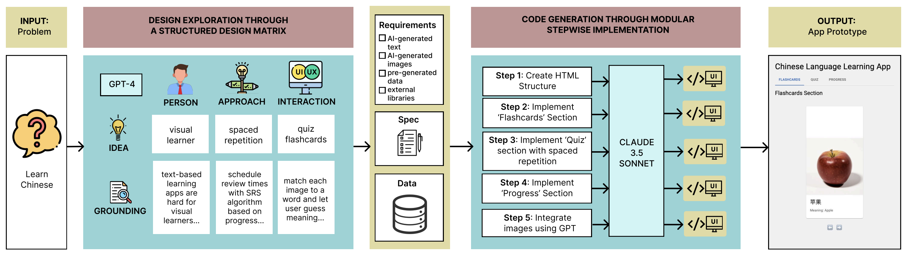

# DynEx: Structured Design Exploration for AI Code Synthesis

This repository accompanies our research paper: [DynEx: Dynamic Code Synthesis and Structured Design Exploration For Accelerated Exploratory Programming](https://arxiv.org/abs/2410.00400). It contains the code to our core dimensions for Design Matrix exploration, as well as our modular code generation pipeline. Below are the steps to set up DynEx on your local machine.  

# Set Up  
You must run both the FE and BE for this repository.  

## Front End  
In one terminal...    
### Set up  
Make sure npm, react, and mui are installed 

### To run FE  
`cd frontend` 
`npm start` 

## BackEnd  
In another terminal...  

### Set up  
1. `cd backend`  
2. `conda env create -n dynex -f environment.yml` 
3. pip install more dependencies if necessary   
4. create a `.env` file within the backend directory   and add your Open AI API key and Anthropic API Key. They should be saved as follows: `"ANTHROPIC_API_KEY"="xyz"`, and `"OPENAI_API_KEY"="xyz"`  
5. create a `generated` folder within backend directory - this is where all the generated code will stay
   
### To run BE  
`conda activate dynex` 
`python server.py`  
